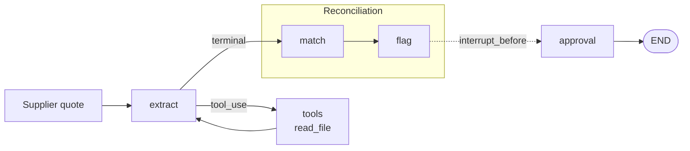

# procure-agent

[](https://github.com/mister2fresh/procure-agent/actions/workflows/ci.yml)

A manufacturing-ops AI agent for SMB procurement workflows. Quote reconciliation ships first; supplier onboarding, product master, and BOM creation share the same architecture and ship behind it.

The reference workflow takes a supplier quote in mixed format (PDF-style tabular, prose email, non-standard CSV, docx, `.eml`), extracts a structured `Quote`, matches every line against the product master, flags divergences from the last reference (price, currency, pack size, UoM), and pauses for a human approval before any state change downstream. Test cases derive from real procurement experience at two manufacturers. The edge cases (substituted SKUs, UoM-in-SKU-stem, tier prices, revised-quote refs, IBC sizing, locale-formatted dates) are not synthetic guesses.

## Architecture



Five nodes, one conditional edge, one interrupt:

- **`extract`**: Anthropic SDK turn against the system prompt + the fixture path. On `tool_use`, dispatches `read_file`; on terminal turn, parses fenced JSON into a `Quote`.
- **`tools`**: hand-rolled dispatch table (`HANDLERS`) over `tool_use` blocks; not `langgraph.prebuilt.ToolNode`. The body of the from-scratch ReAct loop's `for` over content blocks, lifted into a node.
- **`should_continue`**: pure routing function over the last message: `"tools"` if any `tool_use` block, else `"match"`.
- **`match`**: five-tier short-circuit cascade over `procure_agent.products`:
  1. `supplier_sku_exact` (what the supplier offered)
  2. `requested_sku_exact` (what the buyer asked for)
  3. `supplier_sku_fuzzy` (pg_trgm trigram similarity)
  4. `requested_sku_fuzzy`
  5. `description_fuzzy`
  6. `unmatched` (fallthrough)
- **`flag`**: divergence comparison against the matched product: `price_variance` (>10%), `currency_mismatch`, `pack_size_drift`, `uom_mismatch`. UoM and pack-size comparisons go through tolerance predicates so cosmetic drift (`Gal` vs `gal`, `5kg pail` vs `5 kg pail`) doesn't fire.
- **`approval`**: `interrupt_before=["approval"]` halts the graph; the FastAPI HITL endpoint reads state, attaches per-line decisions (`approve` / `reject` / `override`), and resumes via the same `thread_id`. Override re-runs `_flag_one` against the override product so a typo on the override surfaces fresh divergence flags before the line goes downstream.

State is a `TypedDict` with `messages: Annotated[list[dict], operator.add]`. Node returns concatenate via the reducer; node bodies stay pure (read state, return delta). The PostgresSaver checkpoints every node transition; resume after process restart works against the same `thread_id`. Domain rows live in the `procure_agent` schema; LangGraph checkpoint tables live in `public`.

## Stack

**Backend (api service).** Python 3.12 (uv), LangGraph (Anthropic SDK underneath), Claude Sonnet 4.6 as the planner / Haiku 4.5 for extraction, FastAPI for the HITL endpoints (`/runs`, `/runs/{id}`, `/runs/{id}/resume`, `/fixtures`, `/products/search`, `/health`), Postgres (LangGraph PostgresSaver + hand-rolled SQL migrations under `migrations/`), pg_trgm for fuzzy SKU/description match. LangSmith tracing.

**Frontend (web service).** Next.js 16 (App Router, server components by default), TypeScript strict, Tailwind v4, shadcn/ui (base-ui-backed), Zod 4 as the FE single source of truth, Biome. Server actions for mutations; the browser never speaks directly to FastAPI. Next.js proxies through explicit Route Handlers (Railway's private network is IPv6-only, and `next.config.ts` rewrites resolve through Node's legacy `dns.lookup` which doesn't reach v6-only hosts; see *Failure mode* below).

**Deploy.** Two Railway services from this repo, one Railway-Postgres plugin, single public URL on the web service. Each service has its own Dockerfile + `railway.toml`. CORS is moot in prod (same-origin); local dev uses an explicit allowlist for direct browser pokes against the API.

## Design decisions

**Speak in primitives, not framework abstractions.** The graph is hand-wired (`StateGraph`, `add_node`, `add_conditional_edges`, `add_edge`) rather than `create_react_agent`. The `tools` node is a literal port of the from-scratch loop's dispatch comprehension, not `ToolNode`. Adopting `ToolNode` would have meant wrapping the existing Anthropic-native message blocks and rewiring an already-tuned prompt path. The mapping from loop to graph reads as a refactor, not a rewrite. (Walked end-to-end in `docs/from_primitives_to_langgraph.md`.)

**Reconciliation splits into identity and divergence.** `match` decides which catalog product a quote line refers to (cascade through five SKU/description tiers, UNMATCHED on fallthrough). `flag` decides where the matched offer diverges from our last reference. Splitting them earns trace separability (each is its own LangSmith span), independent eval scoring (identity precision vs. divergence-emission precision), and a HITL surface that can render identity decisions and divergence flags as two distinct sections. A merged `reconcile` would have hidden which decision a regression came from.

**Extraction canonicalizes structured tokens; prose stays verbatim.** UoM lowercases to a closed set (`kg`, `lb`, `oz`, `gal`, `l`, `each`, `case`); SKUs uppercase; dates ISO; money is plain `Decimal` at source precision (no schema-layer 2dp quantizer; Acme's fastener pricing is at three decimals and the validator was truncating it). Supplier names, descriptions, payment/shipping terms, and `raw_notes` extract verbatim. Title-casing supplier names or paraphrasing terms across documents are *matching* concerns, not extraction concerns. Matching is `UPPER(supplier_name) = UPPER(?)` on the join, not a normalization rule embedded in the prompt that would tangle the eval.

**Customer ref ≠ RFQ ref.** `customer_ref` is the supplier's persistent ID for the buyer (Customer #, Account #); same value across every quote. `rfq_ref` is the per-transaction reference this quote responds to (RFQ #, Buyer Ref:). Downstream PO generation needs both columns distinct.

**Tool failures are out-of-band, not schema-relaxed.** `read_file` failures emit `ERROR: <description>` and short-circuit to a typed exception in the loop's JSON-extraction step. Earlier draft instructed the model to emit a JSON object with all-null fields on tool failure; rejected because the schema mirrors what lands in `quotes.line_items` JSONB, and loosening domain types to model a tool failure would force every downstream consumer to null-check fields that are required for a real quote.

**Currency defaults to `USD`, never inferred from supplier metadata.** This tool serves US-anchored procurement workflows. Strict-null rules over-engineered against a deployment context that doesn't exist. The override triggers are explicit ISO codes, compound-symbol tokens (`C$`/`A$`), or bare `€`/`£`/`¥`. Inferring currency from supplier address, area code, state, ZIP, or country is forbidden. That's the actual landmine. The flag layer separately gates `currency_mismatch` on both sides being non-null, so a catalog gap or an extraction silence doesn't fire a bogus divergence.

**Multi-row same-SKU is not a tier table.** Each CSV/table row is its own `QuoteLineItem`. `tier_prices` populates only when a single row carries an inline tier-break statement. Summing-as-headline was considered and rejected: differing prices on same-SKU rows is the signature of supplier tier offers, not buyer split-lot orders, and summing invents a buyer commitment that isn't in the source. Faithful row-by-row extraction; downstream decides duplicates.

**DB as master, CSV as seed source.** Inventory lives in Postgres; the 146-row reference catalog seeds from `data/inventory/inventory.csv` via `scripts/generate_seed_sql.py` (which uses the same Pydantic loader the runtime path uses). Hand-rolled SQL migrations, no ORM coupling for schema. Trade-off: no `--autogenerate`, downgrades not modeled. Fine at this migration count.

**v1 schema is denormalized.** `last_paid_*` and `on_hand_qty` / `reorder_point` / `lead_time_days` collapse what an ERP would split into `products` / `price_history` / `inventory_levels` tables. Explicit v1 simplification; the production split happens when supplier onboarding lands and the supplier-per-product join earns its keep.

**API is the integration boundary, not a script behind a UI.** The earliest plan called for Streamlit. Pivoting to Next.js + FastAPI as separate services made the API the actual surface; future consumers (ERP webhook, Slack bot, MCP server, third-party FE) plug into the same surface. The Next.js app is just the first client.

## Eval

A pytest-driven harness (`evals/run.py`) runs the full graph against every fixture in `data/synthetic_quotes/` with a paired `.expected.json` golden, compares predicted vs. golden field-by-field through a tolerance comparator (`evals/comparator.py`), and writes a timestamped artifact under `evals/runs/`. The comparator buckets each field into `match` / `format_drift` (whitespace-only on prose fields, numeric Decimal equality on money) / `value_mismatch`, and pairs line items by `(requested_sku, supplier_sku, quantity)` with bucket-then-positional fallback for collision cases.

Locked baseline (Claude Haiku 4.5 extraction, 15 fixtures, 70 line items, artifact `evals/runs/20260506T181606Z.json`):

| Metric | Value |
| --- | --- |
| Field match | **817 / 843 (96.9%)** |
| Format drift | 0 |
| Value mismatch | 26 |
| Line P/R | 1.00 on every fixture |
| Cascade: `supplier_sku_exact` | 54 |
| Cascade: `requested_sku_exact` | 1 (NutriGrow KMEAL-44 → KMEAL-50 substitution) |
| Cascade: `supplier_sku_fuzzy` | 5 (terragreen typos: `FME-50`, `BLMD-50`, `ALFM50`, `GRENS-CC`, `BIOCH-2CFT`) |
| Cascade: `requested_sku_fuzzy` | 0 |
| Cascade: `description_fuzzy` | 0 |
| Cascade: `unmatched` | 10 |
| Flag: `price_variance` | 42 |
| Flag: `currency_mismatch` | 5 (legitimate CAD/USD divergences) |
| Flag: `pack_size_drift` | 26 |
| Flag: `uom_mismatch` | 1 |

One of the five `supplier_sku_fuzzy` hits is wrong on supplier-knowledge grounds: `FME-50` (TerraGreen, intended `FEM-50`) fuzzy-matches `FBM-50` (Pacific Agri's feather meal) at 0.40 confidence, because both candidates are one edit from the typo and trigram tiebreak picks alphabetically. This is the override picker's reason for existing: an operator selects the correct SKU from a `/products/search` typeahead, the override path swaps `matched_sku` and re-runs `_flag_one` against the override product, and any divergence against the right SKU (price, currency, pack, UoM) fires fresh before the line goes downstream. A fixture set that only exercised correct fuzzy-recovery would understate what the picker is doing.

The fixture corpus is hand-crafted to exercise specific extraction and matching edge cases:

- Tier pricing, MOQ-in-prose, FX-quoted line, missing freight terms
- SKU substitution (supplier offers `KMEAL-44`, buyer requested `KMEAL-50`; the cascade catches it at tier 2 and the pack-size flag fires correctly on `44 lb bag != 50 lb bag`)
- SKU typos exercising tiers 3–4 of the cascade: `terragreen_TG-2026-1505.csv` has five distinct typo shapes (transposition, missing dash, dropped letter, extra trailing letter), one of which fuzzy-matches the *wrong* sibling and gets caught by the override picker
- UoM-in-SKU-stem (`WORMC-1CY` = 1 cubic yard), packaging-noun UoM columns (`BAG`/`BALE`/`PAIL`/`DRUM`)
- Multiple date formats, multi-currency, revised-quote reference traps
- A non-conformant quote (Acme price list with no order quantities, kept in the corpus as a future-work signal for a `quote_type` discriminator; excluded from the demo dropdown by the "fixture must have a paired golden" invariant)

## Failure mode encountered during the build

**Low-confidence description-fuzzy matches cascading bogus divergence flags.** Diagnosed and fixed pre-Haiku-swap; the field-match numbers in this section are from the Sonnet 4.6 runs that surfaced the bug. The cascade was designed so that lines with no usable SKU (prose-only quotes) fall through to `description_fuzzy` and get a "best-effort" trigram match. First full-corpus eval ran clean on field-match (98.0%) but the flag layer fired 52 `currency_mismatch` flags and 27 `pack_size_drift` flags, most of them noise. Three description-fuzzy hits surfaced the structural problem: in a prose fixture, "drum heat seal closures, kraft" trigram-matched `LINER-DRUM-CL` (a roll of drum liners, not the same product) at 0.36 confidence, then cascaded a 92.3% `price_variance` flag and an asymmetric-None `pack_size_drift`. The HITL operator would have seen "review this 95% price drift on a product we're not actually sure we matched."

Two fixes available, picked the structural one:
- **(a) raise the pg_trgm threshold from 0.3 → 0.45.** Pushes wrong matches to UNMATCHED, where they belong.
- **(b) gate divergence-flag emission on `confidence >= 0.5` in `flag_node`.** Suppresses bogus flags but keeps the wrong match floating around as a "did you mean…?" candidate.

(a) is structurally cleaner: UNMATCHED already encodes the "we didn't find it" decision, and (b) leaks the cascade's confidence into the flag layer. Bumped the threshold; the three wrong matches all moved to UNMATCHED. The `currency_mismatch` noise was a separate root cause: the original prompt's strict-null rule was extracting bare `$` as `null`, which then mismatched against catalog `last_paid_currency = "USD"` on every line. Fixed at two layers: the currency rule pivoted to default-USD (extraction), and `flag_node` now requires both sides non-null before firing `CURRENCY_MISMATCH` (flag layer). Two layers because each fix solves a different failure shape: the pivot eliminates source ambiguity in the application context that actually exists; the gate keeps the flag signal-only against catalog gaps that may exist in any future deployment.

After both fixes: `currency_mismatch` 52 → 5 (the remaining 5 are the legitimate Pacific Coast CAD lines + one NutriGrow USD-vs-catalog-CAD), `description_fuzzy` 3 → 0, `unmatched` 7 → 10 (exactly tracking the cascade movement).

The lesson worth keeping: **eval signal is shaped by what gets surfaced, not by what gets matched.** Field-match alone looked clean across both pre- and post-fix runs (98.0% → 97.7%, within Sonnet stochasticity). The improvement only became legible at the flag layer, where the noise was actually being measured. A single accuracy number flattens the failure shape; per-layer instrumentation is what makes the trade-off visible.

A second deploy-time failure worth noting: Next.js 16's wildcard rewrite (`/api/:path*`) hands proxying to the bundled `http-proxy` package, which uses Node's legacy `dns.lookup` rather than undici. Railway's private network is IPv6-only (`api.railway.internal` resolves only AAAA records), and `dns.lookup` doesn't reliably reach v6-only hosts. SSR worked (server components hit the API through `lib/api.ts`'s direct `fetch`, which is undici and resolves cleanly); browser-side calls 500'd on every request. Replaced the rewrite with explicit Route Handlers (`app/api/fixtures/[filename]/route.ts`, `app/api/products/search/route.ts`). Each is a thin `fetch` pass-through. Considered shipping `NODE_OPTIONS=--dns-result-order=verbatim` instead, rejected because it depends on `http-proxy`'s lookup respecting the order hint and on the OS resolver returning AAAA records first. Two ~12-line shims is a smaller maintenance burden than depending on Node DNS internals.

## Traced sample runs

Three fixtures run end-to-end against the deployed agent, share-linked from LangSmith. Each trace shows the prompts sent to Claude, the model responses, the per-node spans, and token/latency metrics for every step. HITL is two-phase by design: `interrupt_before=["approval"]` ends one `g.invoke()` and `resume_run` starts another, so each `thread_id` produces a *pre-approval* trace and a *post-resume* trace. For runs where the resume half is just `finalize`, only the pre-approval link is shown.

- **Happy-path baseline: `aloe-corp_AC-2026-0421.txt`.** [Pre-approval trace](https://smith.langchain.com/public/7491651b-f314-4088-bfa5-305420ec45f8/r). Single-supplier quote, small line set, clean SKU matches. Demonstrates the full pipeline (extract → match → flag → approval interrupt) executing without divergences.
- **Divergence flags: `cascade-bio_CBS-2026-0428-A.csv`.** [Pre-approval trace](https://smith.langchain.com/public/3f86228a-d805-49cf-8048-216c4253767f/r). Every line matches exactly against seeded inventory, so `match` resolves quickly and the work is in `flag`. `price_variance` and `pack_size_drift` fire across multiple lines. Concretizes the trace-separability claim from *Design decisions*: identity and divergence are visible as distinct spans.
- **Fuzzy match + HITL override: `terragreen_TG-2026-1505.csv`.** [Pre-approval trace](https://smith.langchain.com/public/6e22a229-c3fe-4f5a-b763-57ce00a18725/r) · [Post-resume trace](https://smith.langchain.com/public/ff48a322-2934-40dc-80d7-f874ed6018bc/r). Five deliberate SKU typos exercise tiers 3–4 of the cascade. The pre-approval trace shows the fuzzy fallthrough across all five lines (including the FME-50 wrong-sibling case detailed in *Eval*). The post-resume trace shows a human-chosen override (`ALFM50 → ALFM-50`) arriving via the decision payload and `_flag_one` re-running against the override product before the line goes downstream.

## Local development

```bash
# Backend
uv sync --all-groups
docker compose up -d                              # postgres
uv run python scripts/migrate.py                  # apply domain migrations
uv run python scripts/setup_checkpointer.py      # LangGraph checkpoint tables in public
uv run uvicorn procure_agent.api:app --port 8000

# Frontend
cd web && pnpm install
pnpm dev                                          # Next.js on :3000

# Eval harness
uv run python -m evals.run                        # writes evals/runs/<timestamp>.json
uv run pytest                                     # unit + DB tests
```

The from-scratch loop (`agent.py`) and the LangGraph translation (`graph.py`) are both directly runnable against any fixture in `data/synthetic_quotes/`:

```bash
uv run python -m procure_agent.agent rootwise_RW-2026-0419.txt
uv run python -m procure_agent.graph rootwise_RW-2026-0419.txt
```

Same prompt, same model, same fixture, different runtime substrate.

## What ships next

Architecture supports four workflows; quote reconciliation is the reference implementation. The other three are scoped, not scheduled.

**Supplier onboarding.** Input: new supplier intake form + supporting docs (W-9, COI, catalog). Output: validated vendor master record, missing-data flags, approval-ready packet. Schema scope at this point: extract supplier-rep signatures (name, title, email, phone) into a structured `Contact` model. Until onboarding ships, signatures live verbatim in `quotes.raw_notes` per the current extract rule. No information loss; structured lift is a one-prompt-change away.

**Product master.** Input: new product spec sheet. Output: validated product master record, supplier-candidate links, initial reorder parameters. Triggers the schema split that v1 collapses (`products` denormalization → `products` + `price_history` + `inventory_levels`).

**BOM creation.** Input: finished good spec + component list. Output: validated BOM hierarchy with quantities, UoM, supplier-per-component, cost rollup. Reuses the same node shapes (`extract` → `match` against product master → `flag` divergences → `approval`).

**Roadmap-only fifth workflow: inventory reorder + PO generation.** Monitors on-hand quantities in QBO/Fishbowl/NetSuite, recalculates reorder points from sales velocity and lead time, drafts outbound POs, emails vendors after human approval. Architecture supports it; ERP integration adds real dependency cost so it isn't committed to a date. Strong market signal for non-Shopify SMB pain. Flagged here, not promised.

Other deferred items are tracked in `procure-agent-handoff.md` under *Post-ship backlog* (random fresh-quote generator, file upload, NextAuth, multi-tenant scoping, real-time SSE progress, MCP server wrap, persisted `quotes` + `quote_line_items` write-through).

## Repository layout

```
src/procure_agent/      package code (FastAPI, LangGraph, schemas, prompts, db, normalize)
data/synthetic_quotes/  hand-crafted supplier-quote fixtures + paired .expected.json goldens
data/prompt_examples/   held-out demo fixture for the system-prompt few-shot
data/inventory/         reference inventory CSV (146 rows, seeds the products table)
migrations/             hand-rolled SQL migrations (lexically ordered)
scripts/                migration runner + seed generator + bootstrap_prod_db
evals/                  pytest-driven eval harness + golden set + frozen run artifacts
tests/                  unit tests
docs/                   build_log.md, from_primitives_to_langgraph.md
web/                    Next.js frontend (separate Railway service)
```
